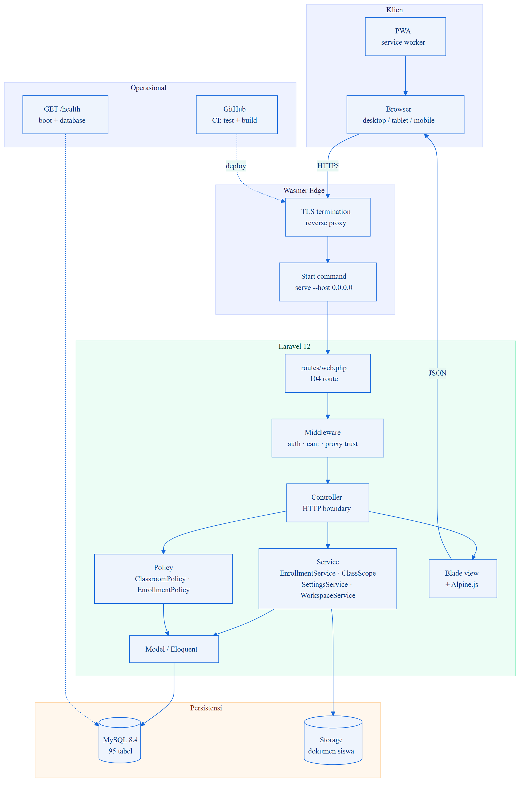

<div align="center">


# SIDA — Sistem Informasi Data Siswa

**Administrasi sekolah berbasis web: PPDB, verifikasi, kelas & enrollment,
absensi, nilai, laporan, dan portal orang tua dalam satu sistem.**

[](https://laravel.com)
[](https://php.net)
[](https://mysql.com)
[](#pengujian)

[Produksi](https://sida-4136.wasmer.app/) · [Dokumentasi](docs/README.md) ·
[Presentasi](docs/presentation/Sistem-Informasi-Data-Siswa-Presentation.pdf)

</div>

---

## Masalah

Data siswa biasanya tersebar di buku pendaftaran, folder berkas, dan spreadsheet
yang disusun ulang setiap tahun. Akibatnya, tiga pertanyaan yang paling sering
ditanya sulit dijawab: siapa yang sudah terverifikasi, kelas mana yang belum
lengkap, dan bagaimana seorang siswa berkembang dari kelas X sampai lulus.

## Tiga keputusan arsitektur

**1 · Enrollment adalah sumber kebenaran.**
Satu siswa memiliki **satu identitas** jangka panjang, tetapi **banyak baris
enrollment** — satu per tahun ajaran, satu per kelas. Naik kelas menutup
enrollment lama dan membuat yang baru; tidak ada yang ditimpa. Kolom
`class_id` yang lama dipertahankan sebagai cermin kompatibilitas.

**2 · Wali Kelas adalah penugasan, bukan peran.**
Guru adalah Kesiswaan *sekaligus* wali kelas X RPL 1, dengan satu akun. Aksesnya
ke kelas lain tetap tertutup, dan penugasan dapat dicatat, diganti, serta
diaudit.

**3 · Otorisasi berlapis.**
Menyembunyikan tombol bukan keamanan. Setiap akses diuji terhadap **izin**,
**cakupan sumber daya**, dan **penugasan**. Mengubah angka pada URL tidak membuka
apa pun.

---

## Tangkapan layar

| Login | Verifikasi |
|---|---|
|  |  |

| Dashboard Admin | Kelas Saya |
|---|---|
|  |  |

| Absensi | Portal Orang Tua |
|---|---|
|  |  |

Seluruh tangkapan layar berasal dari aplikasi yang berjalan, dengan data
demonstrasi yang sepenuhnya fiktif. Indeks lengkap: [docs/SCREENSHOTS.md](docs/SCREENSHOTS.md).

---

## Peran Pengguna

Delapan tingkat, masing-masing dengan pekerjaan yang berbeda nyata:

| Tingkat | Asal | Cakupan data |
|---|---|---|
| Super Admin | Peran | Seluruh sekolah |
| Admin | Peran | Seluruh sekolah |
| Kesiswaan | Peran | Seluruh sekolah |
| Operator | Peran | Data pendaftaran |
| Verifikator | Peran | Verifikasi |
| **Wali Kelas** | **Penugasan** | **Hanya kelas yang ditugaskan** |
| Siswa | Peran | Miliknya sendiri |
| **Orang Tua/Wali** | **Relasi** | **Hanya anak yang tertaut** |

Rincian: [docs/USER-TIERS.md](docs/USER-TIERS.md)

---

## Fitur

**PPDB & Verifikasi** — wizard bertahap, kelengkapan otomatis, antrean
verifikasi dengan alasan yang tercatat.

**Akademik** — tahun ajaran, kelas, enrollment, absensi, nilai, kenaikan kelas,
kelulusan, alumni.

**Administrasi** — 85 permission dalam 7 role, manajemen pengguna, matriks
permission, log aktivitas.

**Portal** — siswa, orang tua, dan wali kelas, dengan navigasi mobile yang
disesuaikan per peran.

**Pelaporan** — report builder, ekspor Excel / CSV / PDF.

Inventaris lengkap beserta status tiap fitur: [docs/FEATURES.md](docs/FEATURES.md)

---

## Teknologi

| Lapisan | Teknologi |
|---|---|
| Framework | Laravel 12 (PHP 8.3+) |
| Tampilan | Blade, Tailwind CSS 4, Alpine.js |
| Aset | Vite |
| Database | MySQL 8.4 — 95 tabel |
| Auth & RBAC | Laravel Sanctum, Spatie Laravel Permission |
| Laporan | Laravel Excel, DomPDF |
| PWA | Manifest + service worker |
| Pengembangan | Docker Compose |
| Produksi | Wasmer + Anybuild |
| CI | GitHub Actions |

---

## Arsitektur

```
Browser / PWA → Laravel 12 → Middleware → Controller → Service → Policy → Model → MySQL 8.4
```



Diagram lengkap: [docs/README.md](docs/README.md#diagram)

---

## Instalasi

```bash
git clone https://github.com/pujosety/Sistem-Informasi-Data-Siswa.git
cd Sistem-Informasi-Data-Siswa
cp .env.example .env

docker compose up -d
docker compose exec app php artisan key:generate
docker compose exec app php artisan migrate --force
docker compose exec app php artisan db:seed --force
docker compose exec app npm install
docker compose exec app npm run build
```

Buka `http://localhost:8000`.

Data demonstrasi untuk seluruh tingkat pengguna:

```bash
docker compose exec app php artisan showcase:seed
```

Panduan lengkap: [docs/INSTALLATION.md](docs/INSTALLATION.md)

---

## Pengujian

```bash
docker compose exec app php artisan test
```

**84 test · 423 assertion** — alur PPDB, batas akses enam peran, cakupan kelas,
cakupan orang tua, integritas enrollment, isolasi workspace, URL produksi.

---

## Deployment

Wasmer + Anybuild. Langkah deploy ada di `anybuild.yaml`, jadi reviewable di
repository:

```yaml
after_deploy: |
  php artisan config:clear
  php artisan migrate --force --no-interaction
  php artisan db:seed --class=PermissionSeeder --force --no-interaction
  php artisan config:cache
  php artisan route:cache
```

`--force` wajib. Tanpa itu `migrate` menampilkan prompt di production, container
tidak punya TTY, dan jawabannya default `[no]` — migrasi dibatalkan dan
aplikasi gagal melayani. Post-mortem: [docs/PRODUCTION-INCIDENT-500.md](docs/PRODUCTION-INCIDENT-500.md)

---

## Dokumentasi

Paket lengkap di **[docs/README.md](docs/README.md)**.

Ringkasan: [Eksekutif](docs/EXECUTIVE-SUMMARY.md) ·
[Produk](docs/PRODUCT-DOCUMENTATION.md) ·
[Fitur](docs/FEATURES.md) ·
[Tingkat Pengguna](docs/USER-TIERS.md) ·
[UI/UX](docs/UI-UX-GUIDELINES.md) ·
[Brand](docs/BRAND-GUIDELINES.md) ·
[Teknis](docs/TECHNICAL-DOCUMENTATION.md) ·
[Basis Data](docs/DATABASE.md) ·
[Keamanan](docs/SECURITY.md) ·
[Instalasi](docs/INSTALLATION.md) ·
[Deployment](docs/DEPLOYMENT.md)

---

## Brand

Identitas visual, palet, dan aturan penggunaan logo ada di
[docs/BRAND-GUIDELINES.md](docs/BRAND-GUIDELINES.md).

---

## Lisensi

[LICENSE](LICENSE)
