# Manual Administrator

Panduan untuk **Super Admin**, **Admin**, **Kesiswaan**, **Operator**, dan
**Verifikator**.

Untuk siswa, orang tua, dan wali kelas, lihat
[USER-MANUAL.md](USER-MANUAL.md).

---

# SUPER ADMIN

Super Admin adalah satu-satunya yang dapat mengelola pengguna, role, dan
konfigurasi sistem.

## 1. Beranda

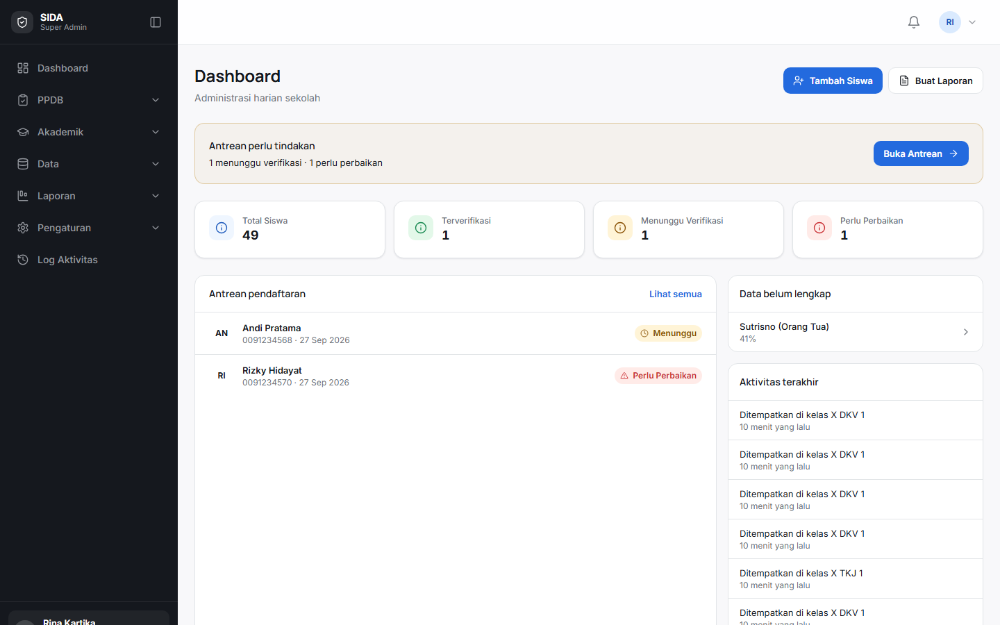

Beranda menampilkan metrik siswa, antrean pendaftaran, data yang belum lengkap,
dan aktivitas terakhir.

## 2. Mengelola pengguna

1. Buka **Data → Pengguna**.
2. Tekan **+ Tambah Pengguna**.
3. Isi nama, email, dan kata sandi sementara.
4. Pilih role.
5. Simpan.

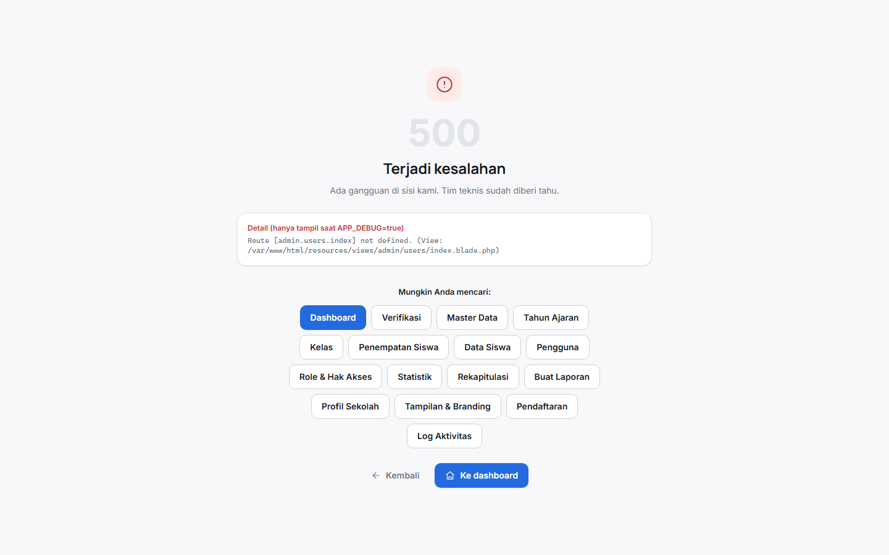

### Menonaktifkan pengguna

1. Buka halaman pengguna.
2. Tekan **Nonaktifkan**.
3. Masukkan alasan.
4. Konfirmasi.

Akun yang dinonaktifkan **tidak dapat login**, meskipun permission-nya masih
terpasang.

### Melindungi akun penting

- Role `super_admin` hanya dapat ditetapkan oleh Super Admin
- Sistem menolak penghapusan atau penurunan Super Admin terakhir
- Admin biasa tidak dapat naik ke `super_admin`

## 3. Mengelola role dan permission

1. Buka **Data → Role & Hak Akses**.
2. Pilih role.
3. Centang permission yang akan diberikan.
4. Simpan.

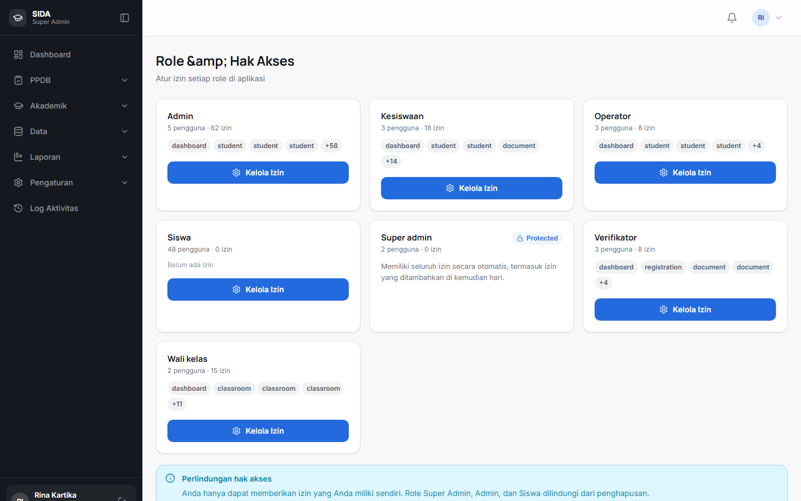

### Perbedaan penting

`classroom.view` hanya membuka **daftar** kelas. Akses ke seluruh sekolah
memerlukan `classroom.view.all`, yang sengaja **tidak** diberikan kepada
`wali_kelas` — itulah pembatas cakupan mereka.

## 4. Mengatur tahun ajaran

1. Buka **Akademik → Tahun Ajaran**.
2. Tekan **+ Tambah Tahun Ajaran**.
3. Isi nama (`2027/2028`), tanggal mulai dan selesai, status.
4. Simpan.

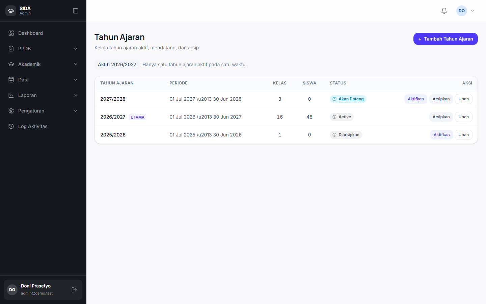

### Status

| Status | Arti |
|---|---|
| Aktif | Tahun berjalan; hanya satu yang boleh aktif |
| Akan datang | Sudah disiapkan, belum aktif |
| Diarsipkan | Sudah selesai; data historis tetap terbaca |

### Mengaktifkan

Tekan **Aktifkan** pada tahun yang ingin dijadikan berjalan. Tahun lain
otomatis turun statusnya.

### Mengarsipkan

Tahun yang masih memiliki siswa aktif **ditolak** untuk diarsipkan. Pindahkan
siswa terlebih dahulu.

## 5. Profil sekolah

1. Buka **Pengaturan → Profil Sekolah**.
2. Isi nama sekolah, NPSN, alamat, kota, kepala sekolah.
3. Simpan.

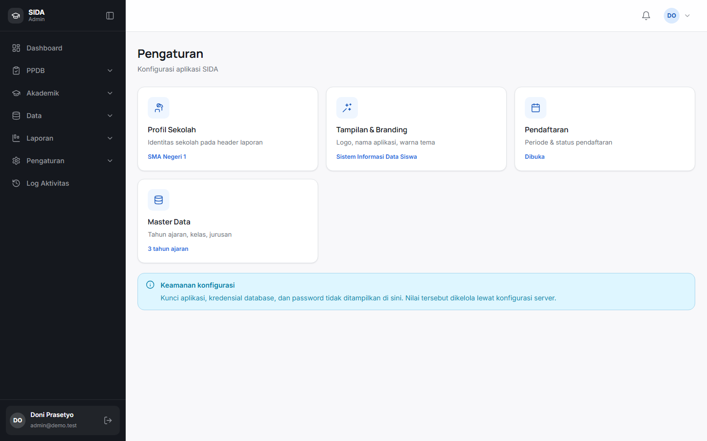

Data ini tercetak pada laporan.

## 6. Branding

1. Buka **Pengaturan → Tampilan & Branding**.
2. Ubah nama aplikasi, warna utama dan aksen.
3. Unggah logo dan favicon.
4. Simpan.

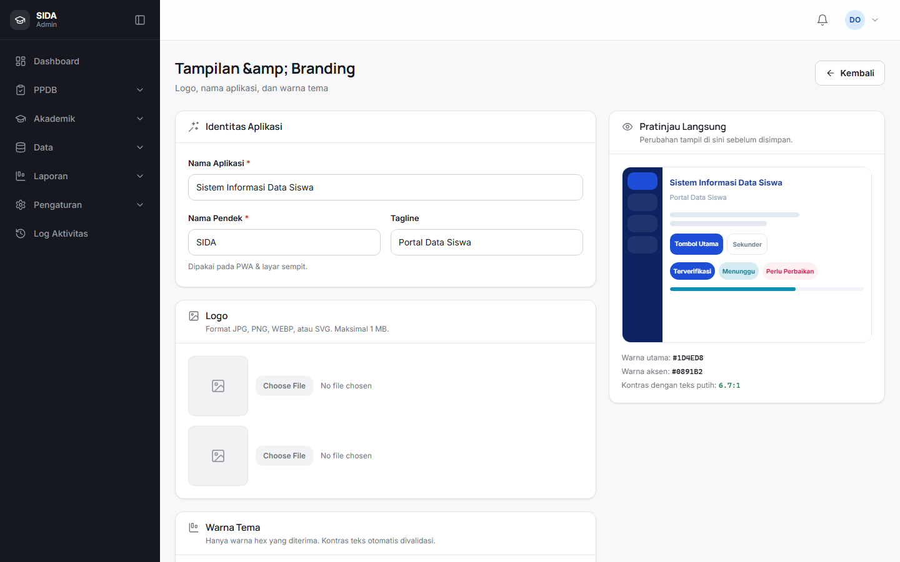

Perubahan langsung terlihat di seluruh aplikasi, termasuk pada halaman error.

## 7. Log aktivitas

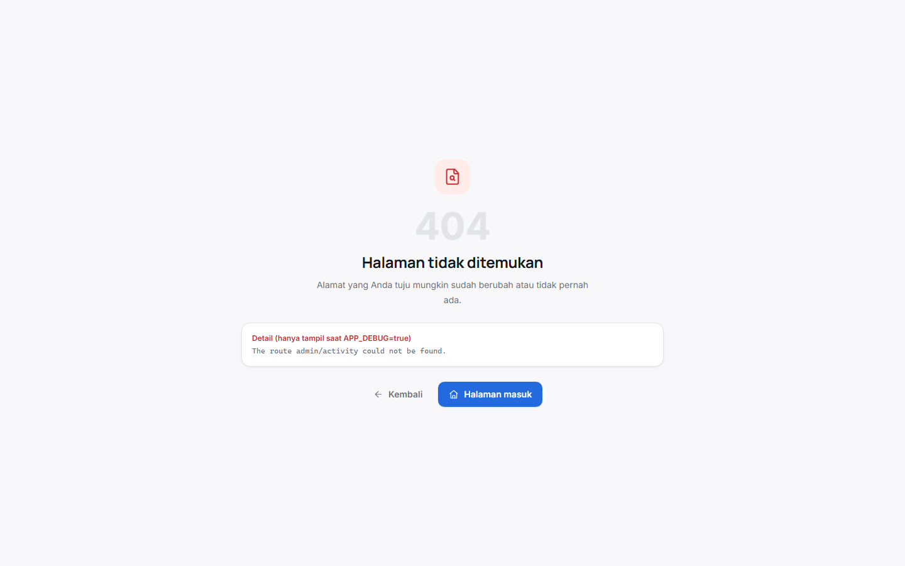

Mencatat login, perubahan role, keputusan verifikasi, penempatan kelas,
penugasan wali kelas, koreksi absensi, dan perubahan pengaturan.

Tidak mencatat kata sandi maupun isi berkas.

---

# ADMIN

## 1. Beranda

Kartu **Antrean perlu tindakan** muncul ketika ada pendaftaran yang menunggu atau
perlu perbaikan. Tekan **Buka Antrean** untuk menanganinya.

## 2. Memverifikasi pendaftaran

1. Buka **PPDB → Verifikasi**.
2. Pilih siswa dari daftar.
3. Periksa kelengkapan data.
4. Periksa tiap dokumen.
5. Berikan keputusan.

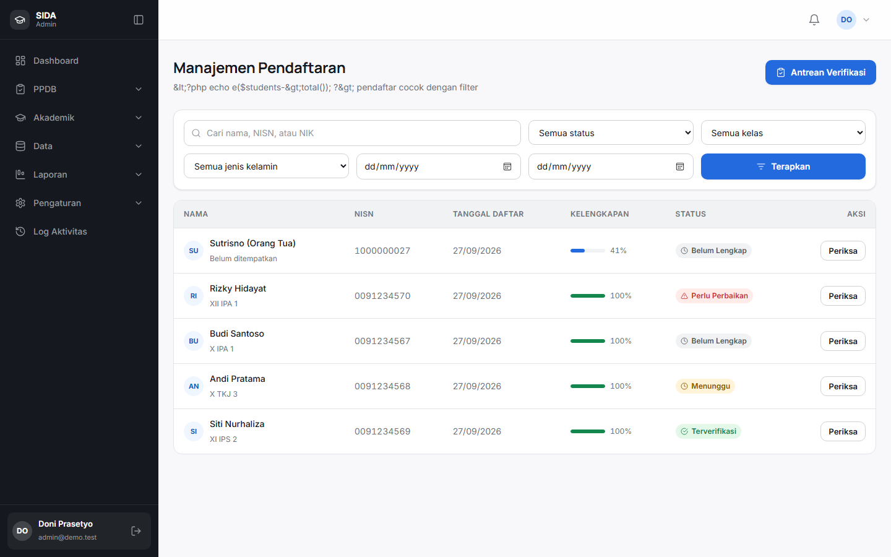

### Keputusan

| Keputusan | Akibat |
|---|---|
| Setujui | Registration menjadi `verified`; siswa dapat ditempatkan |
| Minta perbaikan | Registration menjadi `revision`; siswa melihat alasannya |

**Alasan wajib diisi** pada setiap penolakan. Siswa melihat catatan tersebut.

## 3. Mengelola data siswa

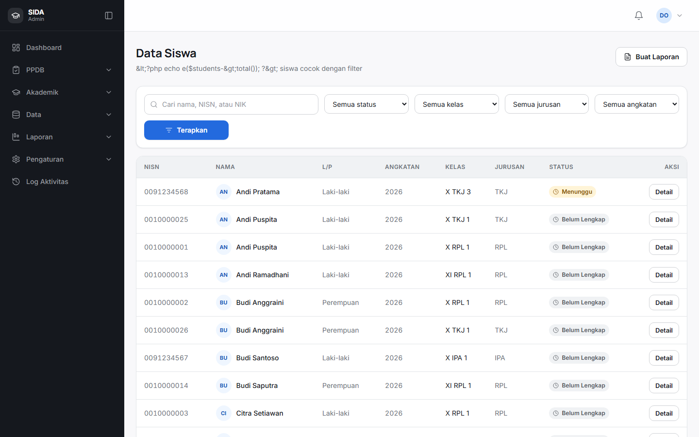

1. Buka **Siswa**.
2. Cari siswa.
3. Buka detailnya.
4. Ubah data bila diperlukan.

## 4. Mengelola kelas

1. Buka **Akademik → Kelas**.
2. Tekan **+ Buat Kelas**.
3. Isi nama, kode, tingkat, jurusan, tahun ajaran, kapasitas, ruang.
4. Simpan.

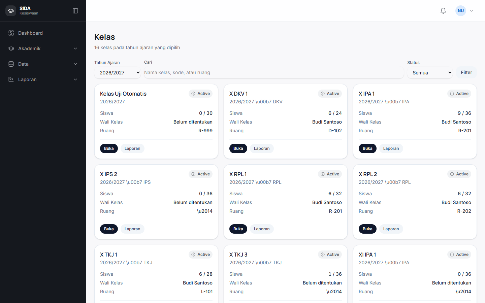

Nama kelas harus unik **dalam satu tahun ajaran**.

## 5. Menempatkan siswa ke kelas

1. Buka **Akademik → Penempatan Siswa**.
2. Pilih tahun ajaran dan kelas tujuan.
3. Cari dan centang siswa.
4. Tekan **Lanjut ke Ringkasan**.
5. Periksa ringkasan.
6. Konfirmasi.

Siswa yang sudah punya enrollment aktif pada tahun yang sama akan **dilewati**,
bukan ditimpa.

## 6. Memindahkan siswa

1. Buka kelas asal.
2. Tekan **Pindahkan** pada baris siswa.
3. Pilih kelas tujuan, tanggal berlaku, dan alasan.
4. Konfirmasi.

Enrollment lama ditutup berstatus `transferred`; yang baru dibuat. Riwayat
tetap terbaca.

## 7. Menugaskan wali kelas

1. Buka ruang kerja kelas.
2. Tab **Wali Kelas**.
3. Pilih pengguna dan tanggal efektif.
4. Simpan.

Penugasan sebelumnya dicatat sebagai riwayat, tidak dihapus.

## 8. Mengatur pendaftaran

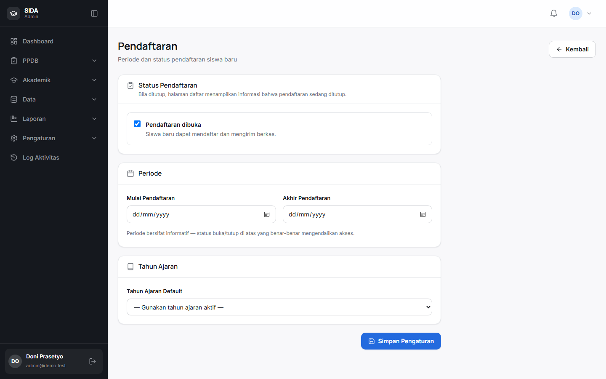

Buka **Pengaturan → Pendaftaran** untuk membuka atau menutup pendaftaran,
mengatur rentang tanggal, dan memilih tahun ajaran aktif.

## 9. Laporan

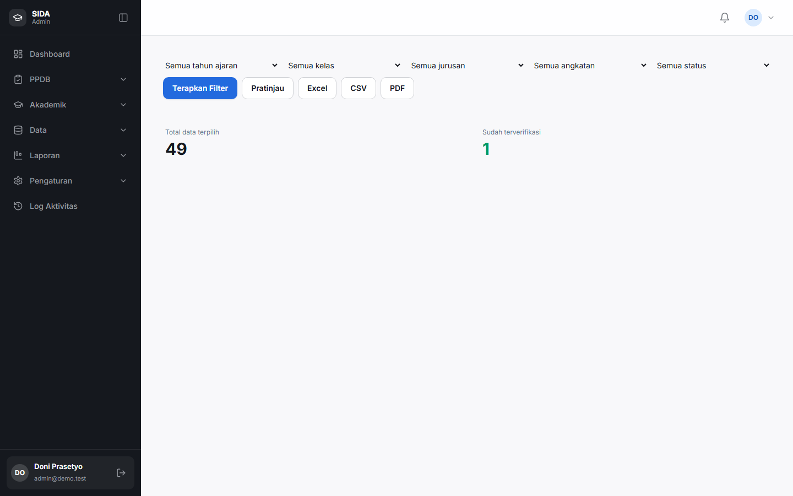

1. Buka **Laporan → Buat Laporan**.
2. Pilih filter.
3. Terapkan.
4. Ekspor ke Excel, CSV, atau PDF.

---

# KESISWAAN

## 1. Beranda

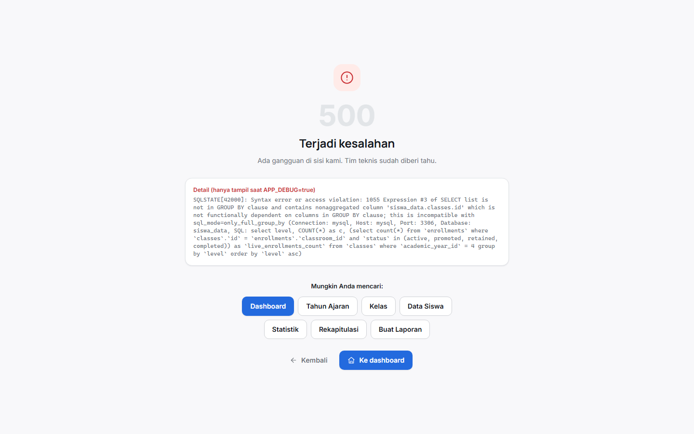

Menampilkan siswa aktif, jumlah kelas, siswa yang belum ditempatkan, data yang
belum lengkap, serta sebaran per tingkat dan jurusan.

## 2. Mencari siswa

1. Buka **Siswa**.
2. Gunakan kolom pencarian atau filter.
3. Buka detail siswa.

## 3. Statistik

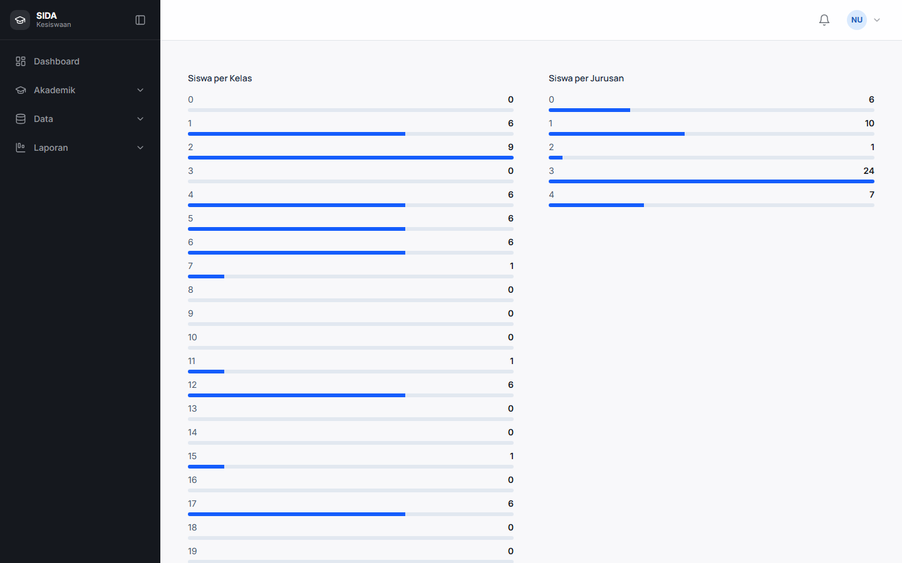

1. Buka **Laporan → Statistik**.
2. Pilih tahun ajaran.
3. Tinjau sebaran siswa.

Kesiswaan **tidak dapat** memverifikasi pendaftaran.

---

# OPERATOR

## 1. Beranda

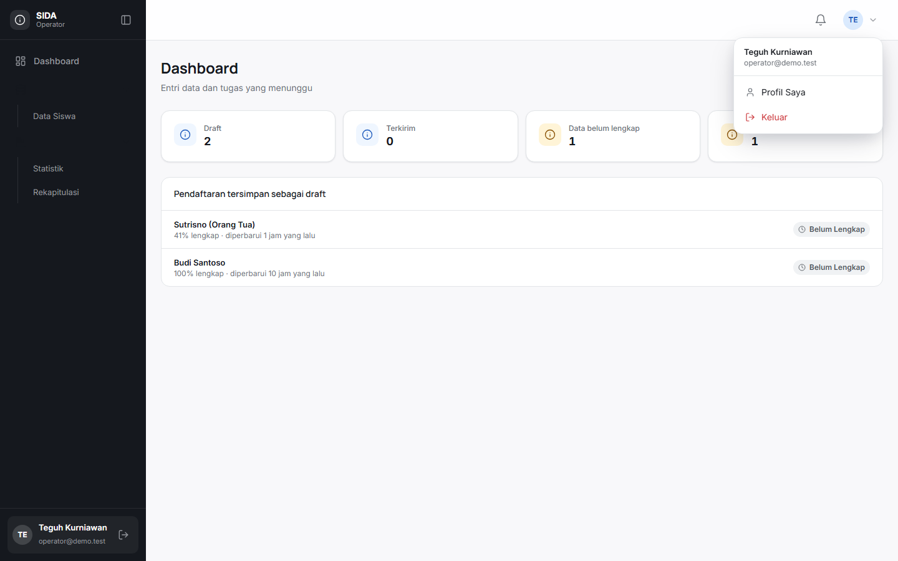

Menampilkan draft yang menunggu, data yang belum lengkap, dan siswa yang belum
ditempatkan.

## 2. Menambah siswa

1. Buka **Siswa**.
2. Tekan **+ Tambah Siswa**.
3. Isi data.
4. Simpan.

Operator **tidak dapat** memverifikasi, menghapus, atau mengelola master data.

---

# VERIFIKATOR

## 1. Antrean verifikasi

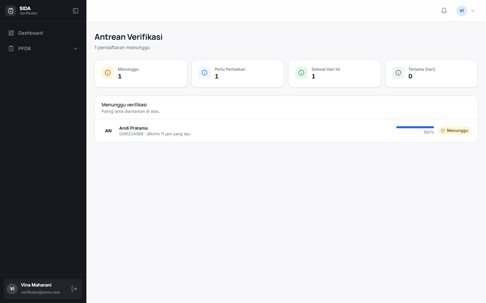

Beranda verifikator **adalah** antreannya. Metrik: menunggu, perlu perbaikan,
selesai hari ini, dan terlama menunggu.

## 2. Meninjau berkas

1. Pilih siswa di antrean — terlama lebih dulu.
2. Periksa kelengkapan data.
3. Buka setiap dokumen.
4. Berikan keputusan beserta alasan.

## 3. Setelah memproses

Antrean langsung menampilkan item berikutnya, tanpa perlu kembali ke daftar.

Verifikator **tidak dapat** mengelola pengguna, role, pengaturan, kelas, atau
master data.
