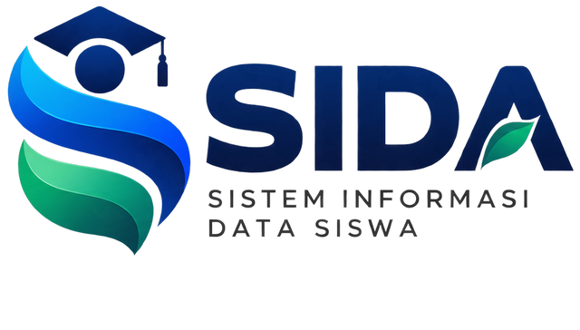

# Screenshot

Seluruh gambar adalah **render nyata** dari aplikasi yang berjalan, diambil
melalui sesi terautentikasi. Tidak ada UI yang digambar, disimulasikan, atau
direkonstruksi.



---

## Bagaimana diambil

```bash
docker compose up -d
php artisan showcase:seed          # data demonstrasi
python tools/shot-batch.py         # seluruh tangkapan layar
```

Edge headless dikendalikan lewat Chrome DevTools Protocol, karena `--screenshot`
bisahanya mengambil halaman publik tetapi tidak bisa menyuntikkan session.

**Data demonstrasi sepenuhnya fiktif** — SMK Demo Nusantara. Tidak ada data
siswa, NIK, atau nomor telepon nyata.

---

## Viewport

| Folder | Ukuran | Device scale |
|---|---|---|
| `desktop/` | 1440 × 900 | 1× |
| `mobile/` | 390 × 844 | 2× |
| `tablet/` | 768 × 1024 | 1× |

---

## Desktop — 1440 × 900

| File | Fitur | Peran | Status |
|---|---|---|---|
| `01-login.png` | Autentikasi | — | Selesai |
| `02-registration.png` | Pendaftaran | — | Selesai |
| `02-super-admin-dashboard.png` | Dashboard | Super Admin | Selesai |
| `03-ppdb-queue.png` | PPDB | Admin | Selesai |
| `04-student-list.png` | Data Siswa | Admin | Selesai |
| `05-reports.png` | Laporan | Admin | Selesai |
| `06-kesiswaan-dashboard.png` | Dashboard | Kesiswaan | Selesai |
| `07-classroom-list.png` | Kelas | Kesiswaan | Selesai |
| `08-statistics.png` | Statistik | Kesiswaan | Selesai |
| `09-operator-dashboard.png` | Dashboard | Operator | Selesai |
| `10-operator-dashboard-2.png` | Workspace Operator | Operator | Selesai |
| `11-verification-queue.png` | Verifikasi | Verifikator | Selesai |
| `12-kelas-saya.png` | Kelas Saya | Wali Kelas | Selesai |
| `13-class-workspace.png` | Ruang kerja kelas | Wali Kelas | Selesai |
| `14-attendance.png` | Absensi | Wali Kelas | Selesai |
| `15-announcements.png` | Pengumuman | Wali Kelas | Selesai |
| `16-student-dashboard.png` | Dashboard | Siswa | Selesai |
| `17-registration-wizard.png` | Wizard pendaftaran | Siswa | Selesai |
| `18-documents.png` | Dokumen | Siswa | Selesai |
| `19-registration-status.png` | Status verifikasi | Siswa | Selesai |
| `20-parent-dashboard.png` | Portal Orang Tua | Orang Tua | Selesai |
| `20b-parent-child-attendance.png` | Absensi anak | Orang Tua | Selesai |
| `21-user-management.png` | Manajemen pengguna | Super Admin | Selesai |
| `22-role-management.png` | Role & permission | Super Admin | Selesai |
| `23-activity-log.png` | Log aktivitas | Super Admin | Selesai |
| `24-school-profile.png` | Profil sekolah | Admin | Selesai |
| `25-branding.png` | Branding | Admin | Selesai |
| `26-academic-year.png` | Tahun ajaran | Admin | Selesai |
| `27-registration-settings.png` | Pengaturan pendaftaran | Admin | Selesai |

## Mobile — 390 × 844

| File | Fitur | Peran |
|---|---|---|
| `rp-admin-dashboard.png` | Dashboard | Admin |
| `rp-kesiswaan-dashboard.png` | Dashboard | Kesiswaan |
| `rp-kelas-saya.png` | Kelas Saya | Wali Kelas |
| `rp-attendance.png` | Absensi | Wali Kelas |
| `rp-verification.png` | Antrean verifikasi | Verifikator |
| `rp-student-dashboard.png` | Dashboard | Siswa |
| `rp-student-list.png` | Data siswa | Kesiswaan |
| `rp-parent-dashboard.png` | Portal Orang Tua | Orang Tua |

## Tablet — 768 × 1024

| File | Fitur | Peran |
|---|---|---|
| `tb-kesiswaan-dashboard.png` | Dashboard | Kesiswaan |
| `tb-attendance.png` | Absensi | Wali Kelas |

---

## Pasangan responsif

Delapan layar penting diambil pada desktop **dan** mobile, untuk membandingkan
perilaku navigasi:

| Layar | Desktop | Mobile |
|---|---|---|
| Dashboard Admin | `02-super-admin-dashboard.png` | `rp-admin-dashboard.png` |
| Dashboard Kesiswaan | `06-kesiswaan-dashboard.png` | `rp-kesiswaan-dashboard.png` |
| Kelas Saya | `12-kelas-saya.png` | `rp-kelas-saya.png` |
| Dashboard Siswa | `16-student-dashboard.png` | `rp-student-dashboard.png` |
| Portal Orang Tua | `20-parent-dashboard.png` | `rp-parent-dashboard.png` |
| Daftar Siswa | `04-student-list.png` | `rp-student-list.png` |
| Antrean Verifikasi | `11-verification-queue.png` | `rp-verification.png` |
| Absensi | `14-attendance.png` | `rp-attendance.png` |

### Yang berbeda antar viewport

| Aspek | Desktop | Mobile |
|---|---|---|
| Navigasi | Sidebar, dapat diciutkan | Bottom navigation, 4 slot + Menu |
| Sidebar | Terbuka 256px,diciutkan 72px | Berubah menjadi drawer |
| Tabel | Tabel penuh | Kartu |
| Absensi | 5 status sebaris | 3×2, tombol lebih besar |
| Filter | Terlihat | Sheet |

Perbedaan yang paling penting: **bottom navigation spesifik per peran.**
Verifikator melihat Antrean lebih dulu, wali kelas melihat Kelas, orang tua
melihat Anak.

---

## Branding di screenshot

Semua tangkapan layar diambil **setelah** integrasi brand SIDA:

- Emblem SIDA di sidebar (dengan light plate karena kontrasnya 1.8:1 di rail navy)
- Emblem di panel login
- Rail sidebar memakai navy `#0b3375`
- Tombol utama memakai biru `#1668dc`
- Judul halaman memakai format `<Halaman> · SIDA`

Aturan lengkap: [BRAND-GUIDELINES.md](BRAND-GUIDELINES.md)

---

## Dokumen terkait

| Screenshot | Dokumen |
|---|---|
| Dashboard per peran | [DASHBOARD-ARCHITECTURE.md](DASHBOARD-ARCHITECTURE.md) |
| Navigasi | [NAVIGATION-ARCHITECTURE.md](NAVIGATION-ARCHITECTURE.md) |
| Komponen & token | [UI-UX-GUIDELINES.md](UI-UX-GUIDELINES.md) |
| Fitur | [FEATURES.md](FEATURES.md) |
| Tingkat pengguna | [USER-TIERS.md](USER-TIERS.md) |
