# Manual Pengguna

Panduan untuk **Siswa**, **Orang Tua/Wali**, dan **Wali Kelas**.
Untuk administrator, lihat [ADMIN-MANUAL.md](ADMIN-MANUAL.md).

Semua tangkapan layar berasal dari aplikasi yang sedang berjalan.

---

# SISWA

## 1. Masuk

1. Buka alamat aplikasi.
2. Masukkan email dan kata sandi dari sekolah.
3. Tekan **Masuk**.

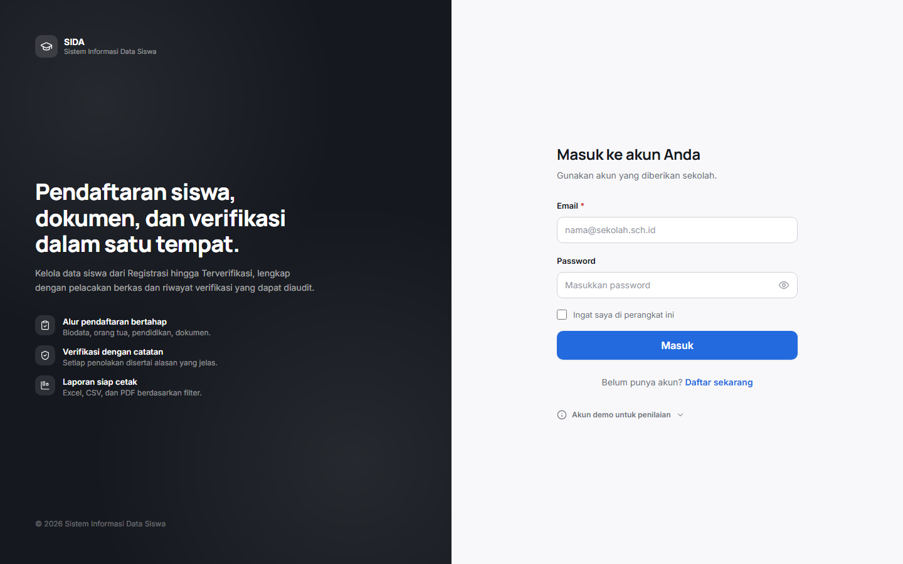

## 2. Memahami beranda

Beranda Anda menunjukkan empat hal: status pendaftaran, progres
kelengkapan, **langkah selanjutnya**, dan dokumen yang perlu diunggah.

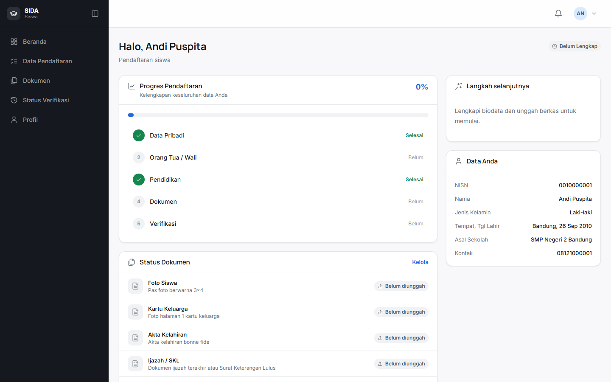

Kartu **Langkah selanjutnya** adalah hal yang paling perlu diperhatikan. Ia
menyatakan tindakan yang harus Anda kerjakan berikutnya.

## 3. Melengkapi pendaftaran

1. Buka **Data Pendaftaran** pada menu.
2. Pilih tahap yang belum selesai.
3. Isi kolom yang ditandai wajib.
4. Tekan **Simpan dan Lanjut**.

Tahap yang tersedia:

| Tahap | Isi |
|---|---|
| Akun | Email dan kata sandi |
| Pribadi | Biodata dan alamat |
| Orang Tua | Data orang tua/wali |
| Pendidikan | Riwayat sekolah |
| Dokumen | Unggah berkas |
| Review | Periksa sebelum kirim |

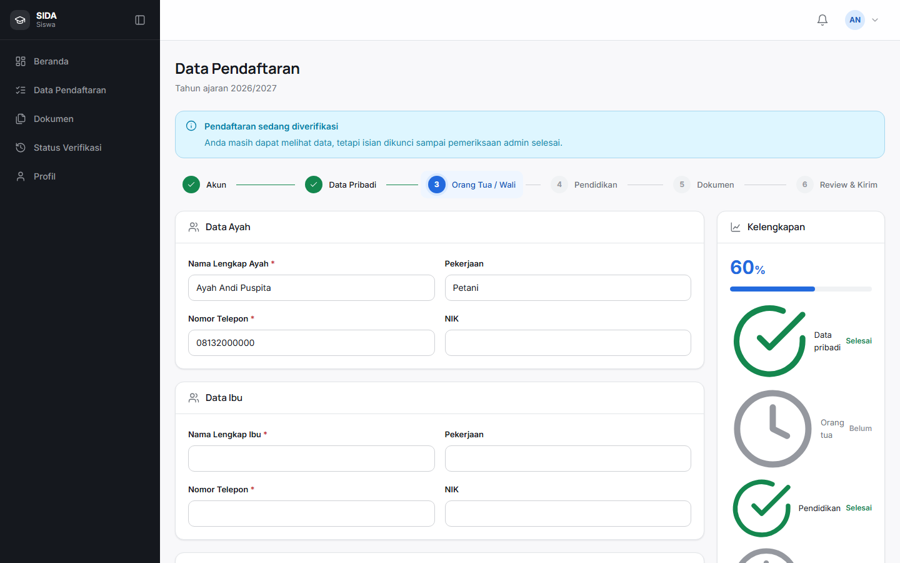

## 4. Mengunggah dokumen

1. Buka **Dokumen**.
2. Tekan unggah pada berkas yang dibutuhkan.
3. Pilih berkas dari ponsel atau komputer.
4. Tunggu sampai muncul tanda **Siap diunggah**.

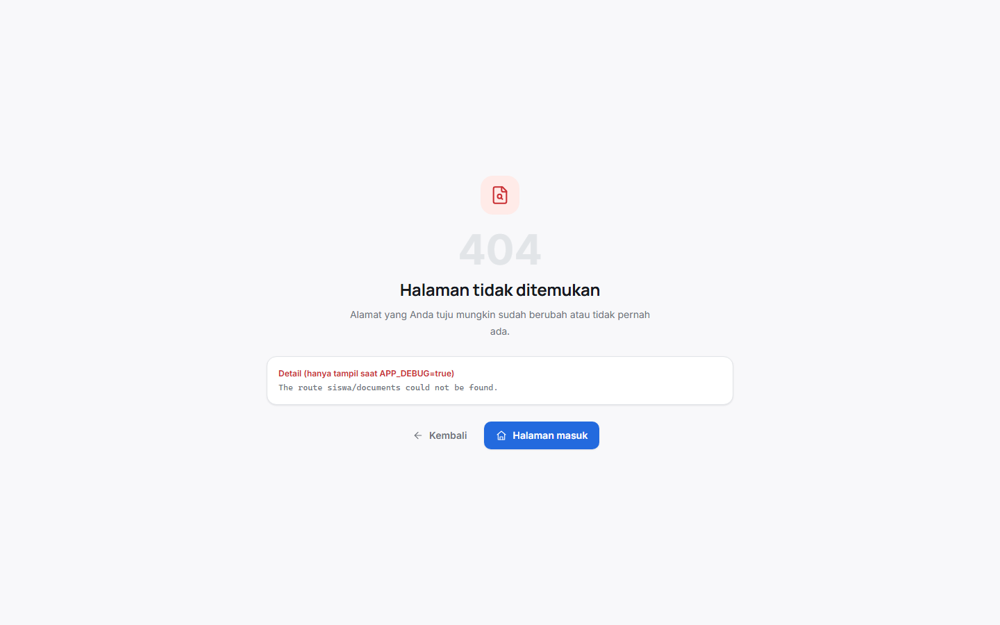

| Status | Arti |
|---|---|
| Belum diunggah | Berkas belum ada |
| Valid | Sudah diterima |
| Perlu revisi | Ada catatan dari sekolah |
| Ditolak | Berkas ditolak |

## 5. Memantau status verifikasi

1. Buka **Status Verifikasi**.
2. Periksa status registration Anda.

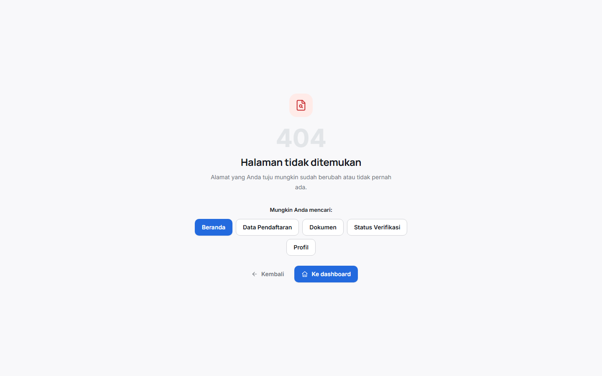

| Status | Arti |
|---|---|
| Belum lengkap | Data masih kurang |
| Terkirim | Menunggu verifikasi |
| perlu perbaikan | Ada berkas yang harus diunggah ulang |
| Terverifikasi | Pendaftaran selesai |

## 6. Mengganti kata sandi

1. Buka **Profil**.
2. Pilih bagian kata sandi.
3. Masukkan kata sandi lama dan yang baru.
4. Tekan **Simpan**.

---

# ORANG TUA / WALI

## 1. Masuk

1. Buka alamat aplikasi.
2. Masuk dengan akun yang diberikan sekolah.

## 2. Melihat anak

Beranda menampilkan satu kartu untuk setiap anak yang tertaut ke akun Anda.
Kartu memuat nama, kelas, kehadiran, kelengkapan data, dan status.

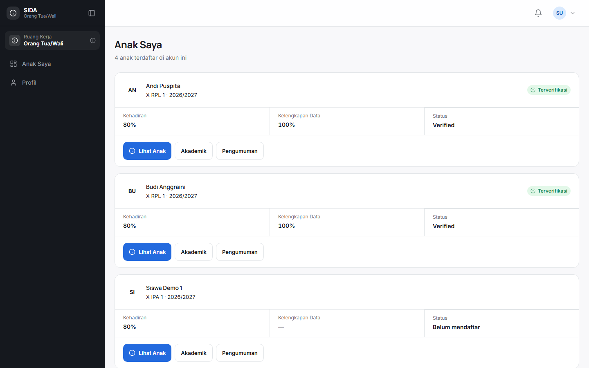

## 3. Membuka absensi anak

1. Tekan **Lihat Anak** pada kartu.
2. Pilih **Absensi**.

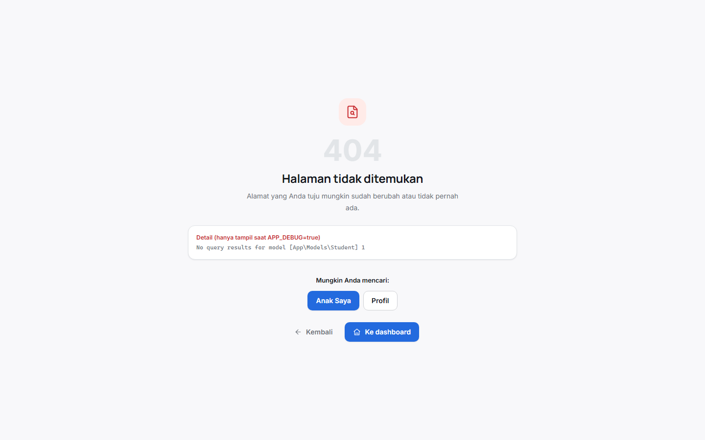

Ringkasan menampilkan jumlah catatan per status dan persentase kehadiran.

## 4. Melihat nilai anak

1. Tekan **Akademik**.

Nilai yang tampil **hanya yang sudah diterbitkan**. Nilai yang masih diproses
tidak pernah ditampilkan.

## 5. Membaca pengumuman

1. Tekan **Pengumuman**.

Pengumuman kelas anak Anda akan tampil beserta tanggal publikasinya.

---

# WALI KELAS

## 1. Masuk

1. Buka alamat aplikasi.
2. Masuk dengan akun guru Anda.

Anda akan diarahkan ke **Kelas Saya**.

## 2. Melihat kelas yang ditugaskan

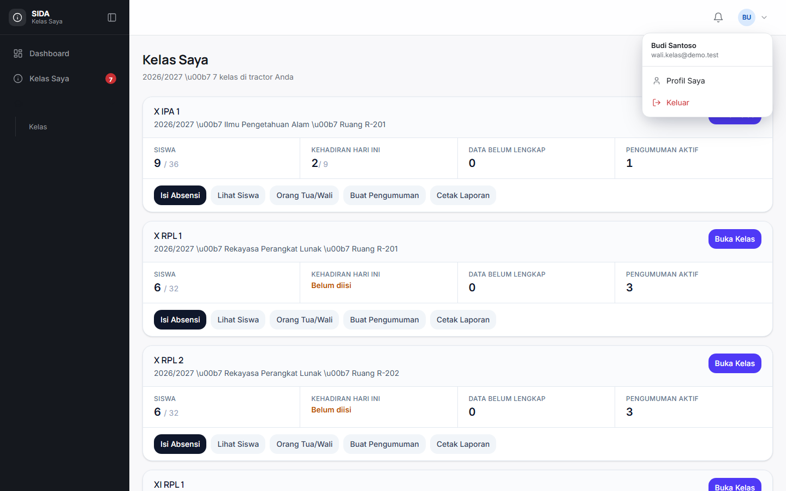

Untuk setiap kelas tampil: jumlah siswa, kehadiran hari ini, data yang belum
lengkap, dan pengumuman aktif. Tekan **Buka Kelas** untuk masuk ke workspace.

## 3. Mengisi absensi

Absensi adalah tugas harian yang paling sering dilakukan.

1. Buka kelas Anda.
2. Tekan **Isi Absensi**.
3. Pilih tanggal bila perlu mengisi hari sebelumnya.
4. Pilih status setiap siswa.
5. Tekan **Simpan Absensi**.

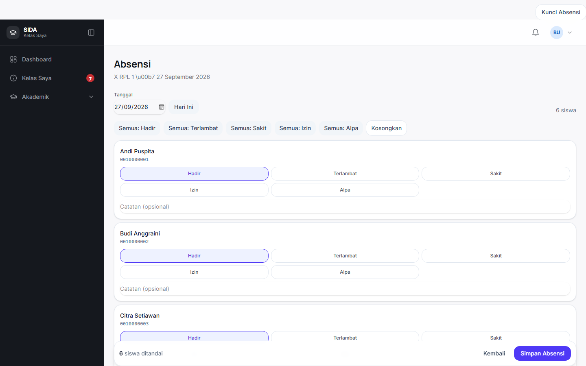

### Status

| Status | Arti |
|---|---|
| Hadir | Hadir tepat waktu |
| Terlambat | Datang terlambat |
| Sakit | Berhalangan karena sakit |
| Izin | Dengan izin |
| Alpa | Tidak hadir tanpa keterangan |

### Tips praktis

- **Tidak ada siswa yang otomatis berstatus hadir.** Anda yang memilih.
- Gunakan tombol **Semua: Hadir** untuk memberi Hadir ke semua, lalu ubah
  satu per satu siswa yang bermasalah.
- Gunakan **Kosongkan** bila ingin memulai dari awal.
- Di ponsel, tombol status tampil dua baris agar mudah ditekan.

## 4. Melihat siswa kelas

1. Buka kelas Anda.
2. Tab **Siswa**.

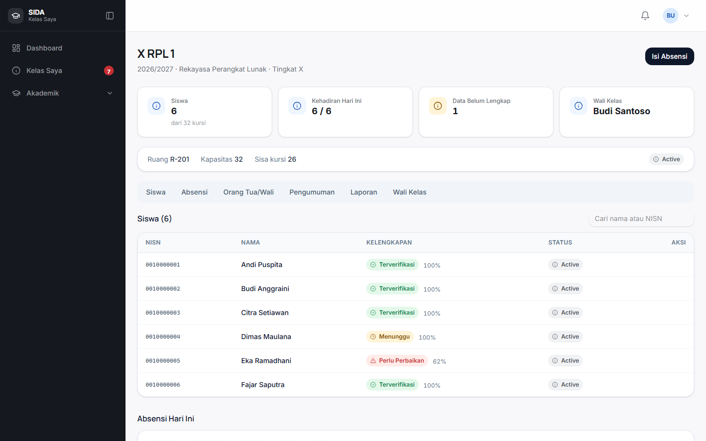

## 5. Membuat pengumuman

1. Buka tab **Pengumuman**.
2. Tekan **+ Pengumuman**.
3. Isi judul dan isi.
4. Pilih audiens: siswa, orang tua, atau keduanya.
5. Centang **Langsungublikasikan** bila siap.

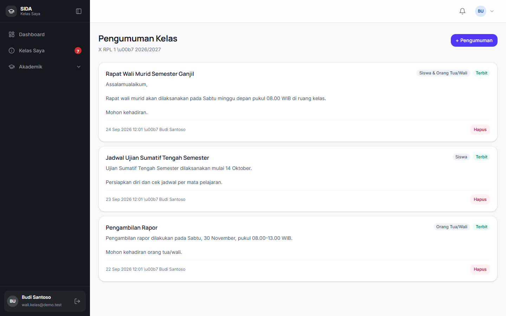

Pengumuman hanya dikirim ke kelas Anda.

## 6. Melihat orang tua/wali

Tab **Orang Tua/Wali** menampilkan nama siswa, nama wali, hubungan, dan
kontak. Data ini hanya tersedia bila Anda memiliki izin yang sesuai.
